<p align="center">
  

  <h3 align="center">VOD Streaming App</h3>

  <p align="center">
   Adaptive Video On Demand Streaming Application
  </p>
</p>

## About The Project

video on demand adaptive streaming service built with nodejs ..

## Features

List the ready features in this project:

- Elasticsearch for movie searching, filtering and sorting
- IMDB scraper for seeding movie details when creating new entry in the admin panel
- Bull Queue system for queueing transcoding tasks
- ffmpeg for transcoding .
- hls adaptive streaming working on ios, andriod and web browsers
- Nginx as reverse proxy for nodejs application
- Nginx as media file server
- Nginx Jwt Module + lua to add authorization for accessing content depending on users subscriptions
- Stripe as payment gateway .
- Simple Admin panel to crud movies .

## Diagram explaining Used Services

<p align="center">
  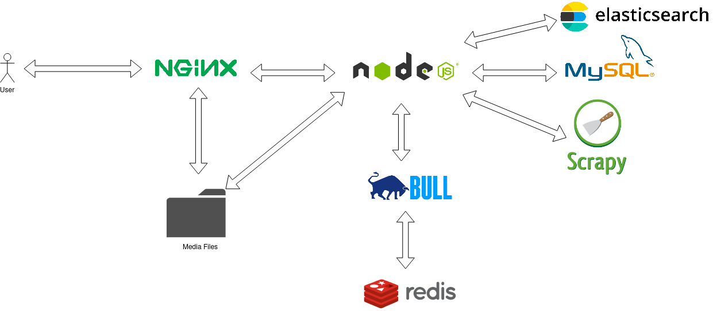
</p>

## Usage

1. Clone the repo

   ```sh
   git clone https://github.com/civilcoder55/streaming-app.git
   ```

2. update env file

3. run containers

   ```sh
   sudo docker-compose up -d
   ```

4. access website at
   ```sh
   http://localhost:8080
   ```
## TO DO

- [ ] Add scrapy containter and endpoint
- [ ] Add stripe integrations
- [ ] Add mail service
- [ ] enhance Admin panel Queue 

## Credits
html template used in this app was purchased from https://themeforest.net/item/flixgo-online-movies-tv-shows-cinema-html-template/22538349#  
## Screenshots
<h3 align="center">folder structure</h3>
<p align="center"></p>
<br>
<h3 align="center">different screenshots</h3>
<p align="center">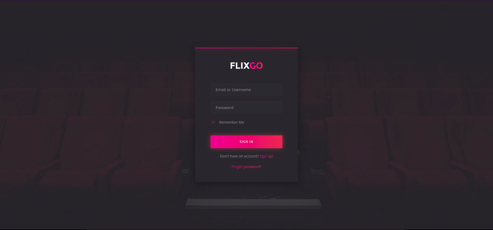</p>
<p align="center">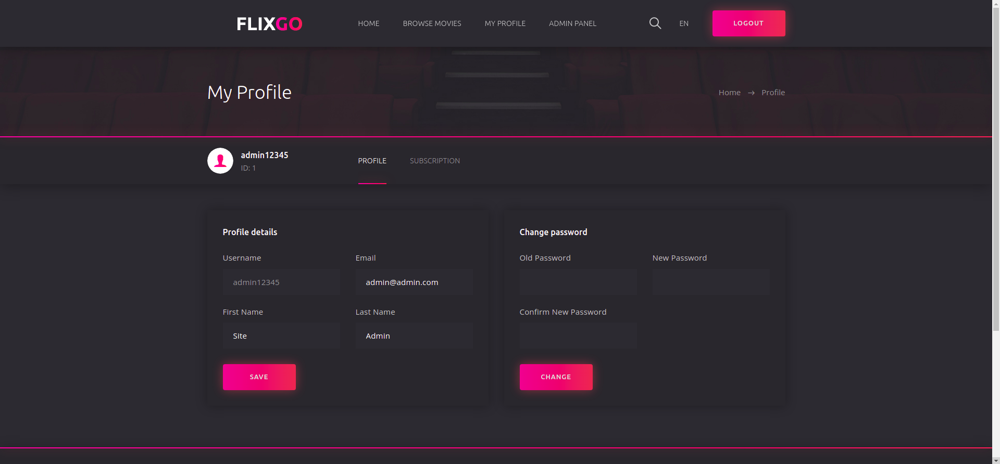</p>
<p align="center">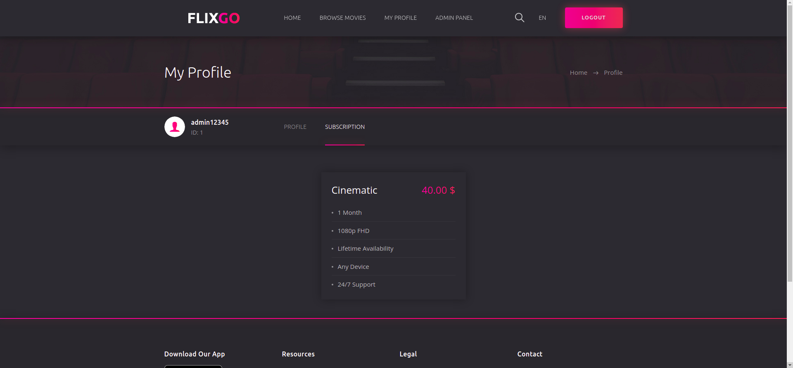</p>
<p align="center">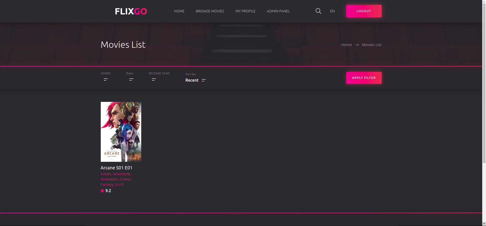</p>
<p align="center">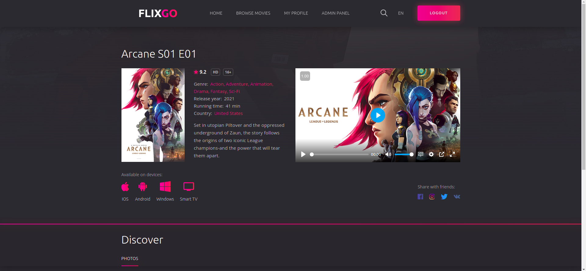</p>
<p align="center">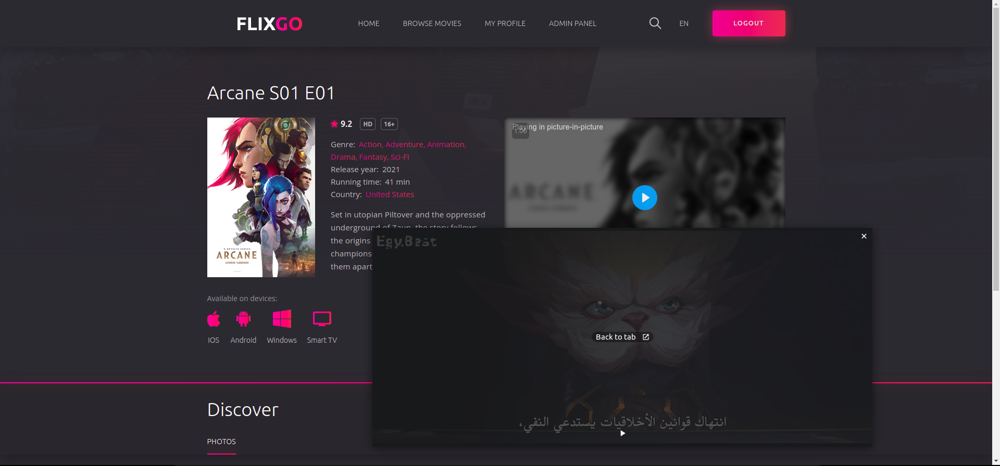</p>
<p align="center">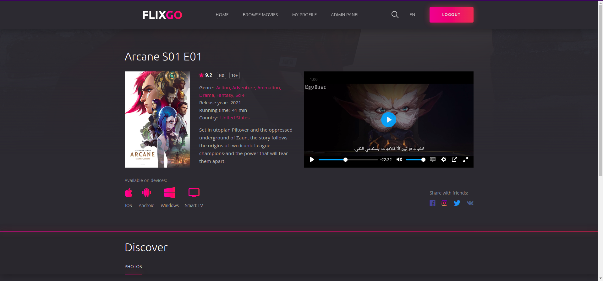</p>
<p align="center">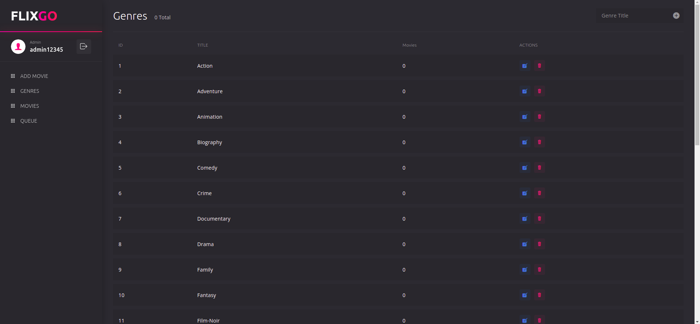</p>
<p align="center">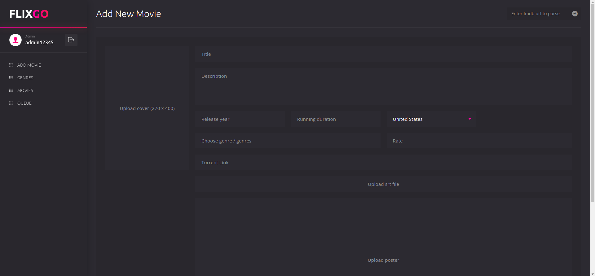</p>
<p align="center">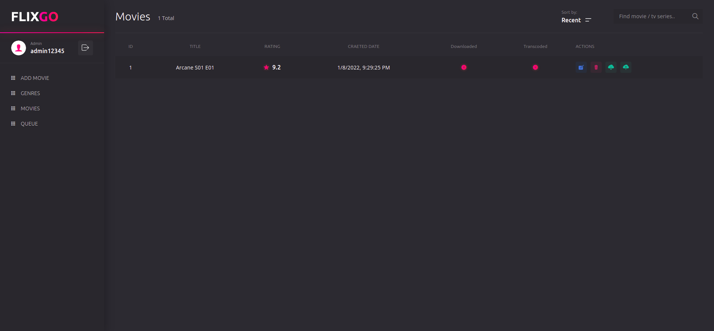</p>
<p align="center">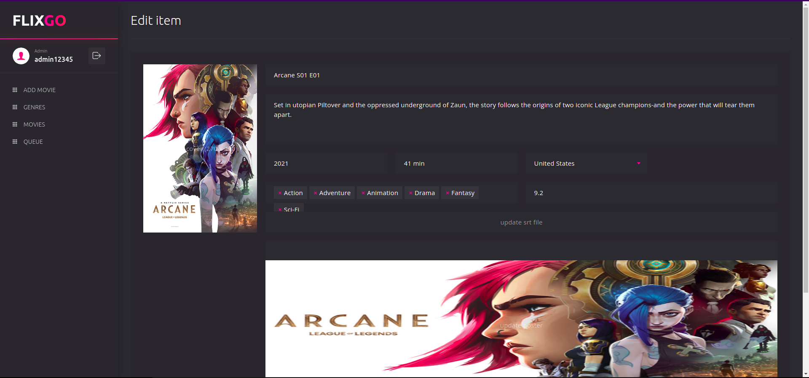</p>
<p align="center">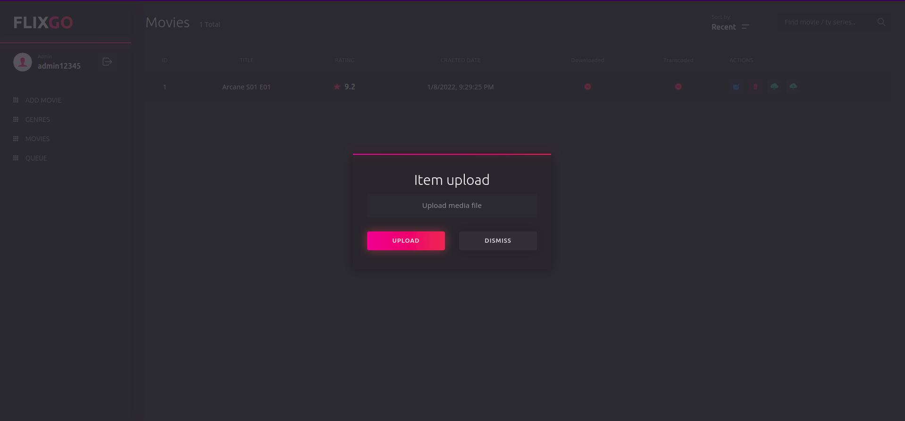</p>
<p align="center">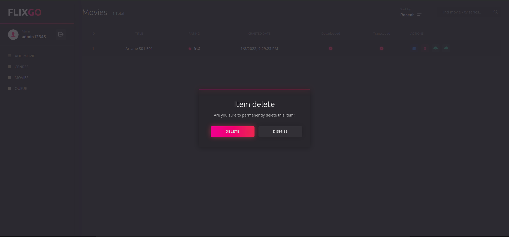</p>
<br>

<!-- ## TO DO

-   [x]. -->
